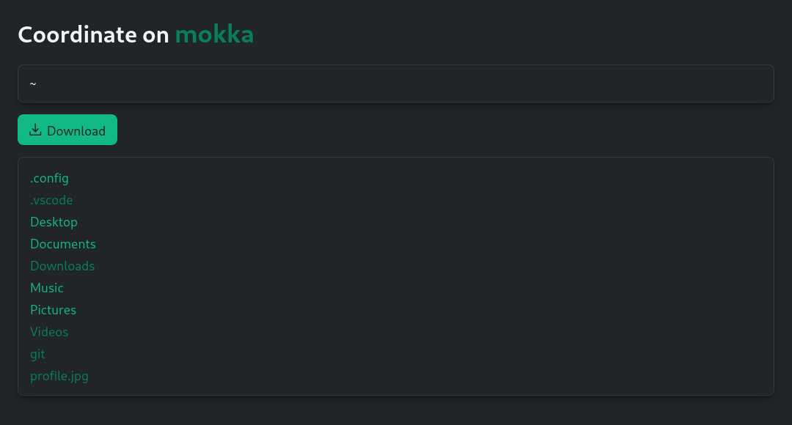

# Coordinate


A simple and friendly file sharing utility

## What is this?

Coordinate is a terminal based file sharing utility. Have you ever just wanted to share a PDF or picture to your peers, to your phone or another computer but had to use a USB stick or send it via a messaging app? (Apple users yeah ik you exist and your life is wonderful) With this tool, you can launch a web page - a coordinate - with the files from your working directory so that others can access it via the local network.

## Installation and usage

```sh
make build
make install

coordinate path/to/directory
```

## What does it look like?



See more at [SAMPLES.md](assets/SAMPLES.md)

## Features

- Access from all devices in the network
- Startup from shell
- Download files
- QRCode link

## TODO

- [X] Handle executable encoded or protected files
- [ ] Packaging for various platforms
- [X] Single file sharing
- [X] Use random strings for internal URIs
- [ ] Context menu action for File Explorer, Dolphin, Nautilus etc.

I swear I'll rewrite all this in Rust one day...
